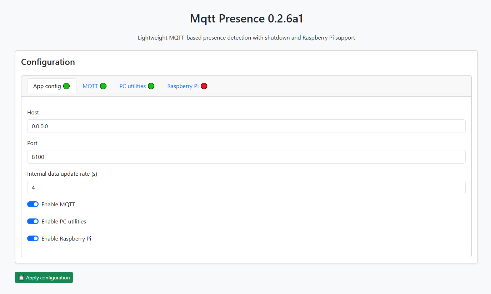

# mqtt-presence

[](https://badge.fury.io/py/mqtt-presence)
[](https://opensource.org/licenses/Apache-2.0) 
[](https://github.com/bjoernboeckle/mqtt-presence/actions)


**mqtt-presence** is a lightweight Python-based presence indicator for MQTT systems. Originally designed for Raspberry Pi environments, it now supports Windows, Linux. It reports the online status of a device (e.g., a PC) and listens for shutdown or restart commands.  
It is especially useful in smart home environments such as [Home Assistant](https://www.home-assistant.io/) in combination with a mqtt broker.

---

## ✨ Features

- Publishes device online state and other pc information to MQTT  
- Receives shutdown and restart commands via MQTT  
- Supports Home Assistant MQTT Discovery (optional)
- Cross-platform: Windows, Linux  
- Provides Web UI and Console UI  
- Configuration via YAML and JSON files  

---

## 🚀 Getting Started

### 🪟 Windows

Download  and run the installer exe from the latest release:

[GitHub releases](https://github.com/bjoernboeckle/mqtt-presence/releases)

```bash
mqtt-presence-vx.x.x-setup.exe
```


The prgramm will be installed as a service placed in %ProgrammData%\mqtt-presence.
After a succefull installation, the web ui can be opened using:

http://localhost:8100

> **Note:** Installation and uninstallation require admin rights.


#### 📦  Or using portable Executable

Download the latest executable from the [GitHub releases](https://github.com/bjoernboeckle/mqtt-presence/releases) page.

```bash
mqtt-presence-vx.x.x.exe
```


#### 📝 Or using script
The install script in github can also be used, which performs the same installation as the installer:

```powershell
# Install
iwr -useb https://raw.githubusercontent.com/bjoernboeckle/mqtt-presence/main/scripts/install.ps1 | iex

# Uninstall
iwr -useb https://raw.githubusercontent.com/bjoernboeckle/mqtt-presence/main/scripts/uninstall.ps1 | iex
```

---

### 🐳 Docker

Shutdown/Restart are not supported if running in a container and therefore they are disabled by default.

#### Docker compose
```yaml
services:
  mqtt-presence:
    image: bjoernboeckle/mqtt-presence:latest
    container_name: mqtt-presence
    volumes:
      - ./config/:/config
      - ./log/:/log
    network_mode: host      
```
---


### 🐧 Linux

Just use the install / uninstall script.
mqtt-presence will be installed as system.d service.

```bash
# Install
curl -sSL "https://raw.githubusercontent.com/bjoernboeckle/mqtt-presence/main/scripts/install.sh?$(date +%s)" | bash

# Uninstall
curl -sSL "https://raw.githubusercontent.com/bjoernboeckle/mqtt-presence/main/scripts/uninstall.sh?$(date +%s)" | bash -s -- --yes
```

---

### 🐍 As Python Package

Install via pip:

```bash
pip install mqtt-presence
```

Run:

```bash
mqtt-presence
```

Run as Python module:

```bash
python -m mqtt_presence.main
```

---


## ⚙️ Command Line Options

```bash
mqtt-presence.exe --config CONFIG_PATH --log LOG_PATH   # use CONFIG_PATH as configuration directory
                                                        # use LOG_PATH as log directory
```

---

## 📟 Web UI

Access the Web UI in your browser at:

```
http://<ip-address>:8100
```

Example: [http://localhost:8100](http://localhost:8100)



---

## 🛠 Configuration

Configuration files are created on first run.

### Application Settings: (`configuration.yaml`)

This file is configured using the webUI.

```yaml
# Configuration file for MQTT Presence
# Please refer to the documentation for details on how to configure.
app:
  updateRate: 2
  webServer:
    host: 0.0.0.0
    port: 8100
  mqtt:
    enabled: true
    broker:
```

Changes require a restart of the service, which will be automatically done using the web UI.
Manuall changes require a manual restart.


## 📁 Directory Structure

### Installation paths used by installer/scripts:

| OS        | Paths                                                                                  |
|-----------|----------------------------------------------------------------------------------------|
| **Linux** | Install: `/opt/mqtt_presence` <br> Data: `/etc/mqtt_presence` <br> Logs: `/var/log`    |
| **Windows** | Install: `%ProgramData%\mqtt_presence` <br> Data: `%ProgramData%\mqtt_presence\data` <br> Logs: `%ProgramData%\mqtt_presence\log` |

---

### Default Config/Data Paths

| OS        | Config Path                                 |
|-----------|---------------------------------------------|
| Linux     | `~/.config/mqtt_presence`       |
| Windows   | `%APPDATA%\mqtt_presence`       |
| macOS     | `~/Library/Application Support/mqtt_presence` |

---

### Default Log Paths

| OS        | Log Path                                   |
|-----------|---------------------------------------------|
| Linux     | `~/.local/state/mqtt_presence/`      |
| Windows   | `%LOCALAPPDATA%\mqtt_presence\` |
| macOS     | `~/Library/Logs/mqtt_presence/`      |

---

### Cache Paths

| OS        | Cache Path                                |
|-----------|--------------------------------------------|
| Linux     | `~/.cache/mqtt_presence/status.cache`      |
| Windows   | `%LOCALAPPDATA%\mqtt_presence\Cache\status.cache` |
| macOS     | `~/Library/Caches/mqtt_presence/status.cache` |


---

## 🧠 License & Credits

Licensed under the Apache License 2.0. Developed by [Bjoern Boeckle](https://github.com/bjoernboeckle).  
Special thanks to the Home Assistant community for inspiration and support.
